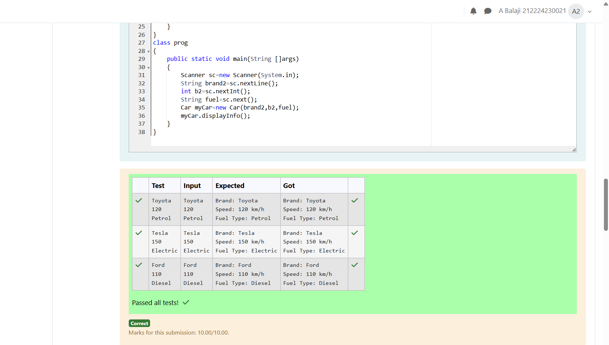

# Ex.No:3(A) INHERITANCE AND AGGREGATION

## QUESTION:


## AIM:
To write a Java program to demonstrate inheritance by creating a superclass Vehicle and a subclass Car that displays vehicle details.


## ALGORITHM :
1. Start the program
2. Import java.util.Scanner
3. Create a superclass named Vehicle
4. Declare variables brand (String) and speed (int)
5. Create a constructor in Vehicle to initialize brand and speed
6. Create a subclass named Car that extends Vehicle
7. Declare an additional variable fueltype
8. Create a constructor in Car
9. Use super() to call the Vehicle constructor
10. Initialize fueltype in the Car constructor
11. Create a method displayInfo() in Car
12. Print brand, speed and fuel type
13. Create a class named prog
14. Create the main() method
15. Create a Scanner object to read input
16. Read brand, speed and fuel type from the user
17. Create a Car object using the inputs
18. Call displayInfo() method
19. Display the vehicle details
20. Stop the program


## PROGRAM:
 ```
/*
Program to implement a Inheritance and Aggregation using Java
Developed by: Balaji Arambakam
RegisterNumber:  21224230021

import java.util.Scanner;
class Vehicle
{
    String brand;
    int speed;
    Vehicle(String s,int a)
    {
        this.brand = s;
        this.speed = a;
    }
}

class Car extends Vehicle
{
    String fueltype;
    Car(String s,int a,String b)
    {
        super(s,a);
        this.fueltype = b;
    }

    void displayInfo()
    {
        System.out.println("Brand: " + this.brand);
        System.out.println("Speed: " + this.speed + " km/h");
        System.out.println("Fuel Type: " + this.fueltype);
    }
}

class prog
{
    public static void main(String[] args)
    {
        Scanner sc = new Scanner(System.in);
        String brand2 = sc.nextLine();
        int b2 = sc.nextInt();
        String fuel = sc.next();

        Car myCar = new Car(brand2,b2,fuel);
        myCar.displayInfo();
    }
}
*/
```

## SOURCE CODE:


## OUTPUT:


## RESULT:
Thus, the Java program to demonstrate inheritance using Vehicle as a superclass and Car as a subclass was executed successfully. 
